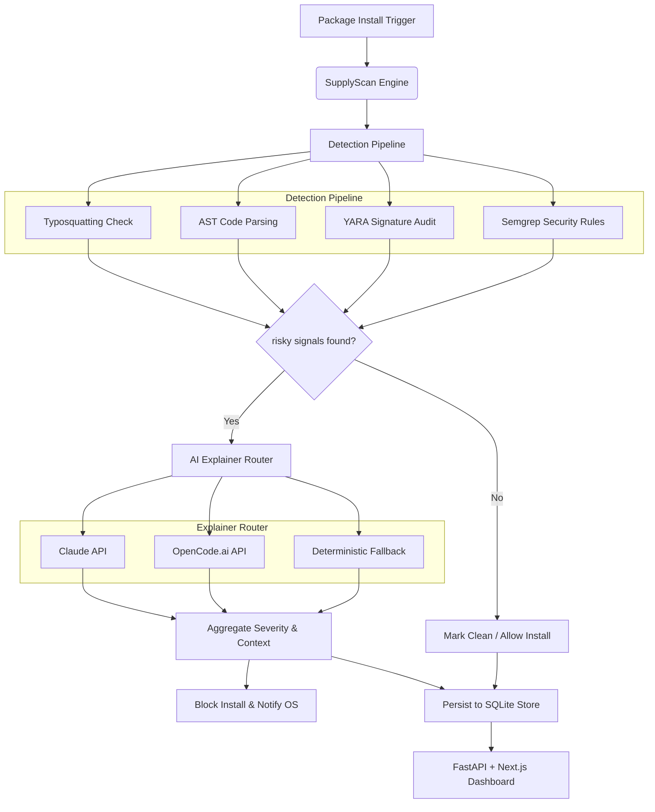

# 🛡️ SupplyScan

SupplyScan is an **autonomous supply-chain security agent** designed to guard developer environments against malicious packages. It intercepts installation-time requests for Python and npm packages, evaluates them against a multi-layered static analysis pipeline, and uses advanced AI models to translate suspicious code patterns into plain-English threat explanations.

<p align="left">
  
  
  
  
  
</p>

---

## ✨ Features

*   **⚡ Automatic Shell Interception:** Seamlessly hooks into `pip` and `npm install` to inspect packages before they run code on your machine.
*   **🔍 Multi-Layered Static Auditing:** Uses AST parsing, custom YARA signatures, Semgrep security rules, and metadata heuristics to spot malicious patterns.
*   **🧠 Robust AI Threat Explainer:** Translates complex detector findings into developer-friendly summaries using Anthropic Claude or OpenCode.ai. AI query exceptions are safely caught and isolated to guarantee scan pipeline completion.
*   **🧪 Interactive Threat Sandbox:** A visual sandbox page featuring real-time layer-by-layer evaluation animation, support for toggling scan modes (Zero-Day Behavioral vs. Known CVEs), and manual package override controls (Block/Report or Clear/Approve).
*   **📊 Integrated Dashboard:** A responsive visual dashboard that tracks execution stats, history, and blocklists.

---

## 🏗️ Architecture

SupplyScan operates on a decentralized, agentic flow where package managers delegate scanning responsibilities to the core engine before completing executions.



---

## 🤖 GitHub Action Integration

SupplyScan can act as an automated CI/CD dependency gatekeeper! When configured, any pull request that introduces a malicious or suspicious package will be blocked automatically, and a detailed threat explanation will be commented directly on the PR.

**Example Proof:** [View a live demonstration of a blocked PR here](https://github.com/vrajbhai/SupplyScan-test/pull/1)

---

## 🚀 Quickstart

Get SupplyScan up and running locally in three steps:

### 1. Installation

Set up a virtual environment and install dependencies:

```bash
# Clone the repository
git clone https://github.com/vrajbhai/SupplyScan.git
cd SupplyScan

# Set up virtual environment
python -m venv .venv
source .venv/bin/activate    # macOS/Linux
.venv\Scripts\Activate.ps1   # Windows

# Install packages
pip install -r requirements.txt
pip install -e .
```

### 2. Configure Your AI Key

SupplyScan checks for API keys in the following order: `CLAUDE_API_KEY` ➡️ `OPENCODE_API_KEY`. You can set them in your terminal session or create a `config.env` file in the project root:

```text
OPENCODE_API_KEY=sk-xxxxVrajBhai
```

> [!NOTE]
> By default, the OpenCode.ai explainer is configured to target `north-mini-code-free`, which works reliably out of the box without hitting strict API usage limits.

### 3. Run the Tools

*   **Initialize Hooks:** Intercept global installations.
    ```bash
    supplyscan init
    ```
*   **Run a Scan:** Analyze a specific package.
    ```bash
    supplyscan check requests
    ```
*   **Launch the Dashboard:** Open the visual web control panel (defaults to `http://127.0.0.1:8000`).
    ```bash
    supplyscan dashboard
    ```

---

## 🛠️ CLI Reference

SupplyScan's command-line interface is powered by `click` and formatted using `rich`:

| Command | Usage | Description |
| --- | --- | --- |
| `init` | `supplyscan init` | Registers environment hooks for `pip` and `npm`. |
| `check` | `supplyscan check <pkg> [--version <v>]` | Audits a package version. Exits with code `1` if blocked. |
| `check -r` | `supplyscan check -r requirements.txt` | Bulk-scans a Python dependency file. |
| `history` | `supplyscan history` | Renders a table of past scans directly in your terminal. |
| `dashboard` | `supplyscan dashboard [--port <p>]` | Starts the FastAPI backend and web server. |
| `remove-hooks`| `supplyscan remove-hooks` | Deregisters package-manager interceptors. |

---

## ⚙️ Environment Variables

Customize how the scanner behaves using system variables:

*   `OPENCODE_API_KEY`: Key used for free-tier explanations.
*   `CLAUDE_API_KEY`: Key used for premium Claude models (preferred if present).
*   `OPENCODE_MODEL`: Override the default OpenCode model (default: `north-mini-code-free`).
*   `PYTHONUTF8`: Set to `1` on Windows systems to force UTF-8 console output.

---

## 🔒 Security Best Practices

*   **Human-in-the-Loop:** SupplyScan acts as a high-fidelity filter. Always review raw findings and signals inside the dashboard before overriding blocks.
*   **Cache & Pin:** Pin your dependency versions in `requirements.txt` and package locks to prevent dependency confusion attacks in your production pipelines.

---

## 🧪 Testing

We run rigorous unit tests against artificial malicious packages located in `tests/malicious/` to verify scanner accuracy:

```bash
pytest -q
```

---

## 🤝 Contributing

Contributions are welcome! Please follow these steps to propose updates:

1.  **Fork** the repository and create a feature branch.
2.  Ensure local **tests** and formatting/linters pass cleanly.
3.  Submit a **Pull Request** referencing related issues.

---

## 📄 License

This project is licensed under the MIT License. Use responsibly.
